# CICD GitHub Action Example #
[](https://sonarcloud.io/project/overview?id=judebantony_cicd-github-action-example)
[](https://sonarcloud.io/component_measures/metric/coverage/list?id=judebantony_cicd-github-action-example)
[](https://sonarcloud.io/component_measures/metric/reliability_rating/list?id=judebantony_cicd-github-action-example)
[](https://sonarcloud.io/component_measures/metric/security_rating/list?id=judebantony_cicd-github-action-example)
[](https://sonarcloud.io/component_measures/metric/code_smell/list?id=judebantony_cicd-github-action-example)
[](https://sonarcloud.io/component_measures/metric/code_smell/list?id=judebantony_cicd-github-action-example)
[](https://app.fossa.com/projects/git%2Bgithub.com%2Fjudebantony%2Fcicd-github-action-example?ref=badge_shield)

[](https://github.com/judebantony/cicd-github-action-example/actions/workflows/test.yml)

[](https://codecov.io/gh/judebantony/cicd-github-action-example)


## CICD - DevSecOps using GitHub Action ##

DevSecOps automatically bakes in security at every phase of the software development lifecycle, enabling development of secure software at the speed of Agile and DevOps. It integrates application and infrastructure security seamlessly into Agile and DevOps processes and tools. It addresses security issues as they emerge, when they're easier, faster, and less expensive to fix and also makes application and infrastructure security a shared responsibility of development, security, and IT operations teams.

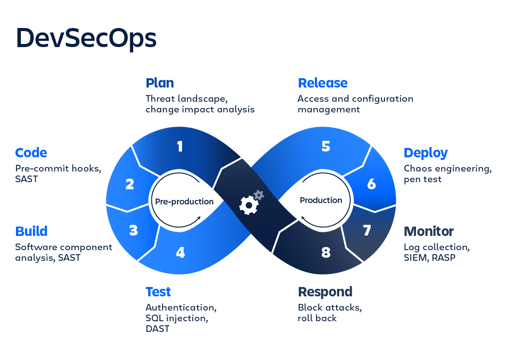

This is a sample project to demonstrate the E2E Github Action release workflow with all Security Controls gates integrated with different Cloud SaaS CI/CD tools offering.

#### Tools used are listed below ####

* Requirements & Planning
    * [JIRA](https://judebantony.atlassian.net)
* Language used
    * [Spring Boot](https://spring.io/projects/spring-boot)
    * [Java](https://www.java.com/en/)
* SCM
    * [GitHub](https://github.com)	
* Build
    * [Mavan](https://maven.apache.org)
* Continuous Integration 
    * [Github Action](https://github.com/features/actions)
* Code Quality
    * [SonarQube](https://sonarcloud.io/organizations/judebantony/projects)
    * [Codecov](https://codecov.io/gh/judebantony/cicd-github-action-example/commit/4b9f0f601ab2feee0e409ede57283d5b99b9182d/build)  	
* SAST (Static Analysis Security Testing)
    * [CodeQL](https://docs.github.com/en/code-security/code-scanning/automatically-scanning-your-code-for-vulnerabilities-and-errors/about-code-scanning-with-codeql)
    * [HCL AppScan CodeSweep](https://www.hcltechsw.com/appscan/codesweep)	
    * [Codacy](https://www.codacy.com/products/sonarqube-alternatives?utm_term=sonarqube&utm_campaign=SEA+-+Competitors&utm_source=adwords&utm_medium=ppc&hsa_acc=9882323101&hsa_cam=11598890837&hsa_grp=112569261106&hsa_ad=493336668133&hsa_src=g&hsa_tgt=kwd-57815990976&hsa_kw=sonarqube&hsa_mt=b&hsa_net=adwords&hsa_ver=3&gclid=CjwKCAiA4veMBhAMEiwAU4XRr_qVWrji3IRgivxyqqPc3QrEMVwBQmQoACBfPuCL5H0gE0nmn3n2LhoCcgkQAvD_BwE)
    * [42crunch](https://platform.42crunch.com)
    * [Fortify](https://www.microfocus.com/en-us/cyberres/application-security/static-code-analyzer?utm_campaign=7018e000000PgpeAAC&utm_content=Search-NB-SEC-Fortify-APJ&gclid=Cj0KCQiAzMGNBhCyARIsANpUkzNu_PaYL3ERhZ-KktUnSxHBTZbFkEOqZYAHFDfE-7m4jviXVhtoUKAaAsSFEALw_wcB)
    * [Coverity](https://www.synopsys.com/software-integrity/security-testing/static-analysis-sast.html?utm_source=google&utm_medium=cpc&utm_term=&utm_campaign=G_S_Coverity_BMM_India&cmp=ps-SIG-G_S_Coverity_BMM_India&gclid=Cj0KCQiAzMGNBhCyARIsANpUkzNY7xgotkaFx4ZukqPDQdZjn6tKU_xYAdWO_Y2t5kD_YpiP5m7DYdAaAlYREALw_wcB)
    * [Checkmarx](https://checkmarx.com)
* SCA (Software Composition Analysis)
    * [Snyk](https://app.snyk.io/org/judebantony)
    * [Dependabot](https://github.blog/2020-06-01-keep-all-your-packages-up-to-date-with-dependabot/)
    * [BlackDuck CoPilot](https://copilot.blackducksoftware.com/github/repos/judebantony/cicd-github-action-example/results) 
    * [FOSSA](https://app.fossa.com/projects/git%2Bgithub.com%2Fjudebantony%2Fcicd-github-action-example/refs/branch/main/0116ae3eef023ccfb56995ab2c4b10aaf5ffe1e1)
    * [Shift Left](https://www.shiftleft.io/apps/shiftleft-java-demo/vulnerabilities?scan=1&branch=demo-branch-1638196402&severity=critical)		
* DAST (Dynamic Application Security Testing)
    * [StackHawk](https://app.stackhawk.com/applications)
    * [OWASP ZAP](https://www.zaproxy.org)
* OpenAPI Spec Validator
    * [Swagger Editor Validator](https://swagger.io/blog/api-design/validate-openapi-definitions-swagger-editor/)  
* Infra as Code Scan
    * [Snyk](https://snyk.io)
    * [OPA](https://www.openpolicyagent.org)
* Secret Scan
    * [Trufflehog](https://github.com/trufflesecurity/truffleHog)
    * [GitGuardian](https://dashboard.gitguardian.com/workspace/190186/analytics)
* Maven Repository
    * [Jfrog Artifactory](https://jfrog.com/artifactory/?utm_source=google&utm_medium=cpc&utm_campaign=14808689020&utm_term=jfrog%20artifactory&utm_network=g&cq_plac=&cq_plt=gp&gclid=Cj0KCQiAhf2MBhDNARIsAKXU5GTNwwGiZx5Msn96nvS7v3kLKexhg50OTeKFkyYJSfFDkmnKLb0OH38aAiOTEALw_wcB)
     * [Github Package](https://github.com/trufflesecurity/truffleHog)
* Helm Repository
    * [Jfrog Artifactiory](https://jfrog.com/artifactory/?utm_source=google&utm_medium=cpc&utm_campaign=14808689020&utm_term=jfrog%20artifactory&utm_network=g&cq_plac=&cq_plt=gp&gclid=Cj0KCQiAhf2MBhDNARIsAKXU5GTNwwGiZx5Msn96nvS7v3kLKexhg50OTeKFkyYJSfFDkmnKLb0OH38aAiOTEALw_wcB)
* Container Scan - Docker Image
    * [Snyk](https://snyk.io)
    * [JFrog Xray](https://jfrog.com/artifactory/?utm_source=google&utm_medium=cpc&utm_campaign=14808689020&utm_term=jfrog%20artifactory&utm_network=g&cq_plac=&cq_plt=gp&gclid=Cj0KCQiAhf2MBhDNARIsAKXU5GTNwwGiZx5Msn96nvS7v3kLKexhg50OTeKFkyYJSfFDkmnKLb0OH38aAiOTEALw_wcB)
* Container Repository
    * [JFrog Artifactory](https://jfrog.com/artifactory/?utm_source=google&utm_medium=cpc&utm_campaign=14808689020&utm_term=jfrog%20artifactory&utm_network=g&cq_plac=&cq_plt=gp&gclid=Cj0KCQiAhf2MBhDNARIsAKXU5GTNwwGiZx5Msn96nvS7v3kLKexhg50OTeKFkyYJSfFDkmnKLb0OH38aAiOTEALw_wcB)
    * [Github Package](https://github.com/features/packages)
    * [DockerHub](https://hub.docker.com/r/judebantony/cigithubaction)
* Deploying to Azure - AKS
    * [GitHub Action & K8S native](https://kubernetes.io)
    * [GitHub Action & Helm Chart](https://helm.sh/docs/topics/charts/)
* Deploying to GCP - GKE 
    * [GitHub Action & Harness](https://harness.io)
* Provisioning(IaC) AWS - EC2
    * [Terraform](https://www.terraform.io)
* Unit Testing
    * [Junit](https://junit.org/junit5/)
    * [Jacoco](https://www.baeldung.com/sonarqube-jacoco-code-coverage)
* Functional Testing
    * [Cucumber](https://cucumber.io)
    * [Xray & Jira for Test Execution](https://docs.getxray.app/display/XRAY/About+Xray)
    * [Selenium](https://www.selenium.dev)
    * [BrowserStack](https://www.browserstack.com)
    * [LamdaTest](https://www.lambdatest.com)
* Performance Testing
    * [K6](https://k6.io)
* Create Release Tag

## CI/CD E2E Release Workflow ##
This Project implements the below CI/CD E2E release workflow integrated with CI, CD, Security Scans, IaC and Test automation using Cloud SaaS tool sets.

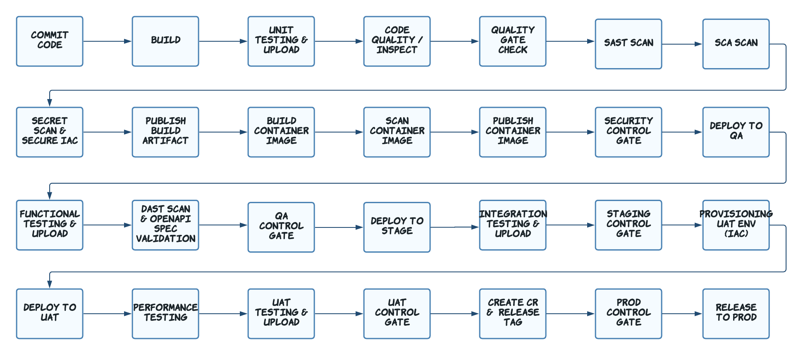	

Sample release workflow implementation using [Github Action](https://github.com/features/actions) is present [here](https://github.com/judebantony/cicd-github-action-example/tree/main/.github/workflows/workflow.yml)


	
Sample release workflow execution is present [here](https://github.com/judebantony/cicd-github-action-example/actions/runs/1500211427)	

## Jira and Github Integration - (Planning/Requirement/Test Execution) ##
Jira and Github Integration will provide better traceability between Planning, Requirement and Test Execution.  [Linking your GitHub account to Jira](https://support.atlassian.com/jira-cloud-administration/docs/integrate-with-github/) gives your team the ability to see their branches, commit messages,build, test cases, test result and pull requests right in the context of the Jira tickets they’re working on. More information can find [here.](https://github.blog/2018-10-04-announcing-the-new-github-and-jira-software-cloud-integration/)

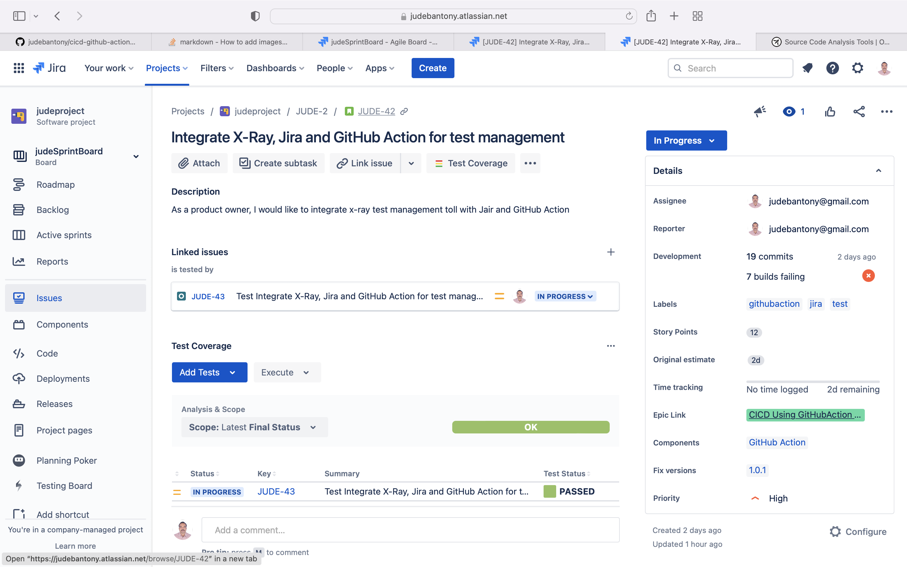

GitHub Commit data is appears in Jira Software.
When a developer makes a commit, they should add a Jira Software issue key to the commit message, like this:

```json
git commit -m "JUDE-42 add a README file to the project."
git push origin <branchname>
```


GitHub Action Build information is appears in Jira Software.


Test Plan & Test Cases using Cucumber & Gherkin is added to Jira


Test results will be uploaded back to Jira to provide [Requirement Traceability Matrix](https://www.tutorialspoint.com/software_testing_dictionary/requirements_traceability_matrix.htm)


## Integration of SaaS tools in CI/CD workflow with GitHub Action ##
Integrating & Implementation of E2E CI/CD release workflow with different cloud SaaS tool using [Github Action](https://github.com/features/actions). 

### 1) Maven - Build and Unit Test ###
[Apache Maven](https://maven.apache.org) is a software project management and comprehension tool. Based on the concept of a project object model (POM), Maven can manage a project's build, reporting and documentation from a central piece of information.

Build the code is using [Maven](https://maven.apache.org) and run the [JUnit](https://junit.org/junit5/) unit test cases, upload the test coverage result to [Github Action](https://github.com/features/actions) . Please check [pom.xml](https://github.com/judebantony/cicd-github-action-example/tree/main/pom.xml). 

```yaml

  test:
    name: Build and Unit Test
    runs-on: ubuntu-latest
    
    steps:
      - name: Check out the code
        uses: actions/checkout@v1
        with:
          fetch-depth: 0
      - name: Set up JDK
        uses: actions/setup-java@v1
        with:
          java-version: 1.8
      - name: Cache Maven packages
        uses: actions/cache@v1
        with:
          path: ~/.m2
          key: ${{ runner.os }}-m2-${{ hashFiles('**/pom.xml') }}
          restore-keys: ${{ runner.os }}-m2     
      - name: Build
        run: mvn -B clean package -DskipTests
      - name: Run UnitTest and Verify 
        run: mvn -B verify -DexcludedGroups="Smoke | Staging | BrowserStack | LamdaTest"
      - name: Generate JaCoCo Badge
        id: jacoco
        uses: cicirello/jacoco-badge-generator@v2
      - name: Log code coverage percentage
        run: |
          echo "coverage = ${{ steps.jacoco.outputs.coverage }}"
          echo "branch coverage = ${{ steps.jacoco.outputs.branches }}"
      - name: Upload code coverage report
        uses: actions/upload-artifact@v2
        with:
          name: jacoco-report
          path: target/site/jacoco/
      - name: Adding Junit Report
        uses: ashley-taylor/junit-report-annotations-action@master
        if: always()
        with:
          access-token: ${{ secrets.GITHUB_TOKEN }}          
      - name: Publish Unit Test Results
        uses: EnricoMi/publish-unit-test-result-action/composite@v1
        with:
           files: target/surefire-reports/*.xml

```


### 2) SonarQube Cloud - Code Quality ###
[SonarQube](https://www.sonarqube.org) is an open-source platform developed by SonarSource for continuous inspection of code quality to perform automatic reviews with static analysis of code to detect bugs, code smells, and security vulnerabilities on 20+ programming languages.

Inspect the code using [SonarQube](https://www.sonarqube.org), enable the quality gate check and upload the result to its Cloud SaaS offering. 

```yaml
  sonar:
    name: Inspect - Using Sonar
    runs-on: ubuntu-latest
    needs: [test]
    
    steps:
      - name: Check out the code
        uses: actions/checkout@v1
        with:
          fetch-depth: 0
      - name: Set up JDK 11
        uses: actions/setup-java@v1
        with:
          java-version: 11
      - name: Cache SonarCloud packages
        uses: actions/cache@v1
        with:
          path: ~/.sonar/cache
          key: ${{ runner.os }}-sonar
          restore-keys: ${{ runner.os }}-sonar
      - name: Cache Maven packages
        uses: actions/cache@v1
        with:
          path: ~/.m2
          key: ${{ runner.os }}-m2-${{ hashFiles('**/pom.xml') }}
          restore-keys: ${{ runner.os }}-m2     
      - name: Build and analyze
        env:
          GITHUB_TOKEN: ${{ secrets.GITHUB_TOKEN }}
          SONAR_TOKEN: ${{ secrets.SONAR_TOKEN }}
        run: mvn -B verify -DexcludedGroups="Smoke | Staging | LamdaTest | BrowserStack" org.sonarsource.scanner.maven:sonar-maven-plugin:sonar -Dsonar.issuesReport.html.enable=true -Dsonar.projectKey=judebantony_cicd-github-action-example
      - name: SonarQube Quality Gate check
        uses: sonarsource/sonarqube-quality-gate-action@master
        env:
          GITHUB_TOKEN: ${{ secrets.GITHUB_TOKEN }}
          SONAR_TOKEN: ${{ secrets.SONAR_TOKEN }}   
        timeout-minutes: 5     
        with:
          scanMetadataReportFile: target/sonar/report-task.txt     

```
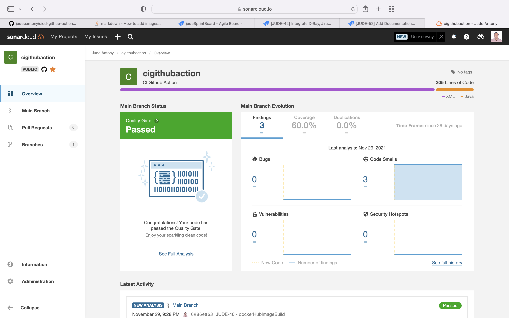
Update the sonar quality gate information to Github Action.


### 3) Codecov - Code Coverage ###
[Codecov](https://about.codecov.io) improve code quality and workflow with highly integrated tools to group, merge, archive, and compare coverage reports.

Upload the code coverage result to [Codecov](https://about.codecov.io) SaaS offering.

```yaml
  codecov:
    name: Inspect - Using Codecov
    runs-on: ubuntu-latest
    needs: [test]
    
    steps:
      - name: Check out the code
        uses: actions/checkout@v1
        with:
          fetch-depth: 0
      - name: Set up JDK 8
        uses: actions/setup-java@v1
        with:
          java-version: 1.8
      - name: Cache Maven packages
        uses: actions/cache@v1
        with:
          path: ~/.m2
          key: ${{ runner.os }}-m2-${{ hashFiles('**/pom.xml') }}
          restore-keys: ${{ runner.os }}-m2     
      - name: Build and analyze
        env:
          GITHUB_TOKEN: ${{ secrets.GITHUB_TOKEN }}
          SONAR_TOKEN: ${{ secrets.SONAR_TOKEN }}
        run: mvn -B verify -DexcludedGroups="Smoke | Staging | LamdaTest | BrowserStack" cobertura:cobertura
      - name: Upload coverage to Codecov
        uses: codecov/codecov-action@v2
        with:
          token: ${{ secrets.CODECOV_TOKEN }} 
          flags: unittests 
          name: codecov-umbrella 
          fail_ci_if_error: true 
          verbose: true     

```
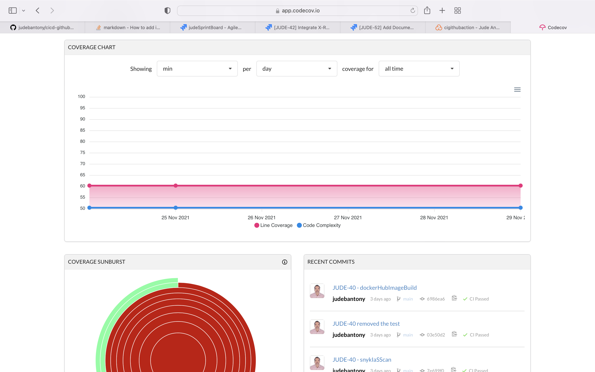


### 4) CodeQL - SAST ###
[CodeQL](https://codeql.github.com) is the code analysis engine developed by GitHub to automate security checks. You can analyze your code using CodeQL and display the results as code scanning alerts.

Use the native Github Action [CodeQL](https://codeql.github.com) for SAST scan and upload the result to [GitHub Advanced Security](https://github.com/security) tab

```yaml
  codeqlScan:
      name: SAST Scan using CodeQL
      runs-on: ubuntu-latest
      needs: [sonar, codecov]
      
      permissions:
        actions: read
        contents: read
        security-events: write
      strategy:
        fail-fast: false
        matrix:
          language: [ 'java' ]
          
      steps:
      - name: Checkout repository
        uses: actions/checkout@v2
        with:
           fetch-depth: 0
      - name: Initialize CodeQL
        uses: github/codeql-action/init@v1
        with:
          languages: ${{ matrix.language }}
      - name: Autobuild
        uses: github/codeql-action/autobuild@v1
      - name: Perform CodeQL Analysis
        uses: github/codeql-action/analyze@v1

```


### 5) AppScan CodeSweep - SAST ###
[HCL AppScan CodeSweep](https://www.hcltechsw.com/appscan/codesweep) is a free to use security tool, designed for beginners and professionals alike, who need a quick, simple, and platform friendly program.

Use the [AppScan CodeSweep](https://www.hcltechsw.com/appscan/codesweep) for SAST scan and upload the result to [GitHub Advanced Security](https://github.com/security) tab using sairf [OWASP](https://owasp.org/www-community/Source_Code_Analysis_Tools) format


```yaml
  appScan:
    name: SAST Scan using AppScan CodeSweep
    runs-on: ubuntu-latest
    needs: [sonar, codecov]
    
    steps:
      - name: Checkout repository
        uses: actions/checkout@v2
        with:
           fetch-depth: 0
      - name: Run AppScan CodeSweep
        uses: HCL-TECH-SOFTWARE/appscan-codesweep-action@v1
        with:
            asoc_key: ${{secrets.ASOC_KEY}}
            asoc_secret: ${{secrets.ASOC_SECRET}}
        env: 
          GITHUB_TOKEN: ${{secrets.GITHUB_TOKEN}}
```


### 6) Codacy - SAST  ###
[Codacy](https://www.codacy.com) automatically analyzes your source code and identifies issues as you go, helping you develop software more efficiently with fewer issues down the line. Through static code review analysis, Codacy notifies you of security issues, code coverage, code duplication, and code complexity in every commit and pull request.

Use the [Codacy](https://www.codacy.com) for SAST scan and upload the result to [GitHub Advanced Security](https://github.com/security) tab using sairf [OWASP](https://owasp.org/www-community/Source_Code_Analysis_Tools) format

```yaml
  codacyScan:
      name: SAST Scan using Codacy
      runs-on: ubuntu-latest
      needs: [sonar, codecov]
      
      steps:
        - uses: actions/checkout@v2
          with:
            fetch-depth: 0
        - name: Run Codacy Analysis CLI
          uses: codacy/codacy-analysis-cli-action@master
          with:
            output: codacy.sarif
            format: sarif
            gh-code-scanning-compat: true
            max-allowed-issues: 2147483647
        
        - name: Upload SARIF results file
          uses: github/codeql-action/upload-sarif@main
          with:
            sarif_file: codacy.sarif          
```

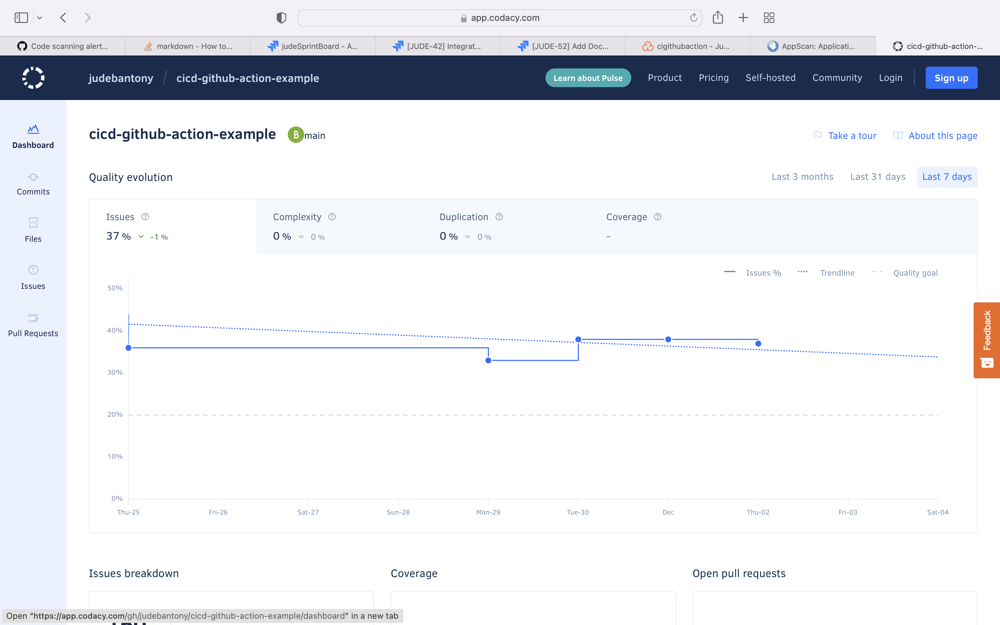

### 7) Snyk - SCA  ###
[Snyk](https://snyk.io) (pronounced sneak) is a developer security platform for securing code, dependencies, containers, and infrastructure as code.

Use the [Snyk](https://snyk.io) for SCA scan and upload the result to [GitHub Advanced Security](https://github.com/security) tab using sairf [OWASP](https://owasp.org/www-community/Source_Code_Analysis_Tools) format

```yaml
  snykScan:
      name: SCA Scan using Snyk
      runs-on: ubuntu-latest
      needs: [codeqlScan, codacyScan, appScan]
          
      steps:
      - uses: actions/checkout@v2
        with:
          fetch-depth: 0
      - name: Set up Maven
        run: mvn -N io.takari:maven:wrapper -Dmaven=3.8.2
      - name: Run Snyk to check for vulnerabilities
        continue-on-error: true      
        uses: snyk/actions/maven-3-jdk-11@master
        env:
           SNYK_TOKEN: ${{ secrets.SNYK_TOKEN }}
        with:
          args: --sarif-file-output=snyk.sarif
      - name: Upload result to GitHub Code Scanning
        uses: github/codeql-action/upload-sarif@v1
        with:
          sarif_file: snyk.sarif

```


### 8) Dependabot - SCA  ###
Use the github native [Dependabot](https://docs.github.com/en/code-security/supply-chain-security/managing-vulnerabilities-in-your-projects-dependencies/configuring-dependabot-security-updates) for SCA scan and upload the result to [GitHub Advanced Security](https://github.com/security) tab 

```yaml dependabot.yml

version: 2
updates:
  - package-ecosystem: "maven"
    directory: "/" 
    schedule:
      interval: "daily"
  - package-ecosystem: "docker"
    directory: "/"
    schedule:
      interval: "weekly"

```


### 9) BlackDuck CoPilot - SCA  ###
[Black Duck](https://www.blackducksoftware.com) is a complete open source management solution, which fully discovers all open source in your code. It can map components to known vulnerabilities, and identify license and component quality risks.

Use the [Black Duck](https://www.blackducksoftware.com) for SCA scan and upload the result to [GitHub Advanced Security](https://github.com/security) tab using sairf [OWASP](https://owasp.org/www-community/Source_Code_Analysis_Tools) format

```yaml 

  blackduck:
      name: SCA Scan using BlackDuck
      runs-on: ubuntu-latest
      needs: [codeqlScan, codacyScan, appScan] 

      steps:
        - name: Check out the code
          uses: actions/checkout@v2
          with:
            fetch-depth: 0
        - name: Set up JDK
          uses: actions/setup-java@v1
          with:
            java-version: 1.8
        - name: Set up Maven
          run: mvn -N io.takari:maven:wrapper -Dmaven=3.8.2
        - name: Build with Maven
          run: |
            mvn install -DskipTests=true -Dmaven.javadoc.skip=true -B -V
            mvn test -B
        - name: Upload to CoPilot
          run: bash <(curl -s https://copilot.blackducksoftware.com/ci/githubactions/scripts/upload)


```
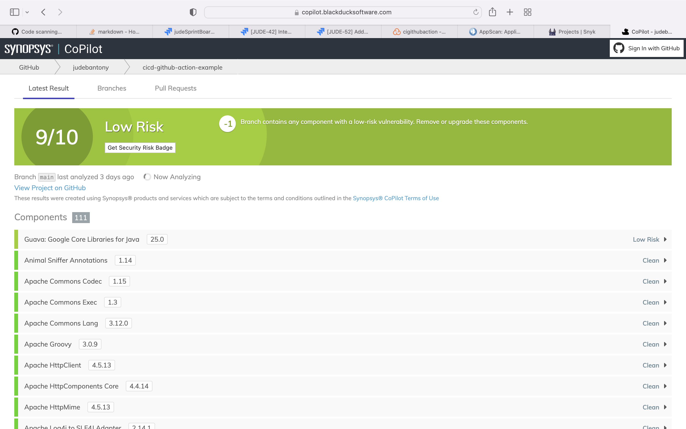

### 10) FOSSA - SCA  ###
[FOSSA](https://fossa.com/variant/homepage) accelerate open source adoption with scalable, end-to-end management for third-party code, license compliance and vulnerabilities.

Use the [FOSSA](https://fossa.com/variant/homepage) for SCA scan and upload the result to [GitHub Advanced Security](https://github.com/security) tab using sairf [OWASP](https://owasp.org/www-community/Source_Code_Analysis_Tools) format

```yaml 

  fossaScan:
      name: SCA Scan using FOSSA
      runs-on: ubuntu-latest
      needs: [codeqlScan, codacyScan, appScan]  
      
      steps:
        - name: Check out the code
          uses: actions/checkout@v2
          with:
            fetch-depth: 0
        - name: Run FOSSA Scan
          uses: fossas/fossa-action@v1
          with:
            api-key: ${{secrets.FOSSA_APIKEY}}


```

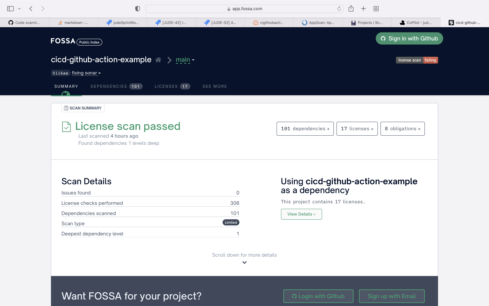

### 11) ShiftLeft - SCA & SAST ###
[ShiftLeft](https://www.shiftleft.io) provides an early, accurate picture of risk so devs can quickly secure code and stay focused on the transformation. 

Use the [ShiftLeft](https://www.shiftleft.io) for SCA & SAST scan and upload the result to [GitHub Advanced Security](https://github.com/security) tab using sairf [OWASP](https://owasp.org/www-community/Source_Code_Analysis_Tools) format

```yaml 

   shitLeftScan:
      name: SAST and SCA Scan using ShiftLeft
      runs-on: ubuntu-latest
      needs: [codeqlScan, codacyScan, appScan, rest-api-static-security-testing]
      steps:
      - uses: actions/checkout@v2
      - name: Perform Scan
        uses: ShiftLeftSecurity/scan-action@39af9e54bc599c8077e710291d790175c9231f64
        env:
          WORKSPACE: ""
          GITHUB_TOKEN: ${{ secrets.GITHUB_TOKEN }}
          SCAN_AUTO_BUILD: true
        with:
          output: reports
      - name: Upload report
        uses: github/codeql-action/upload-sarif@v1
        with:
          sarif_file: reports


```

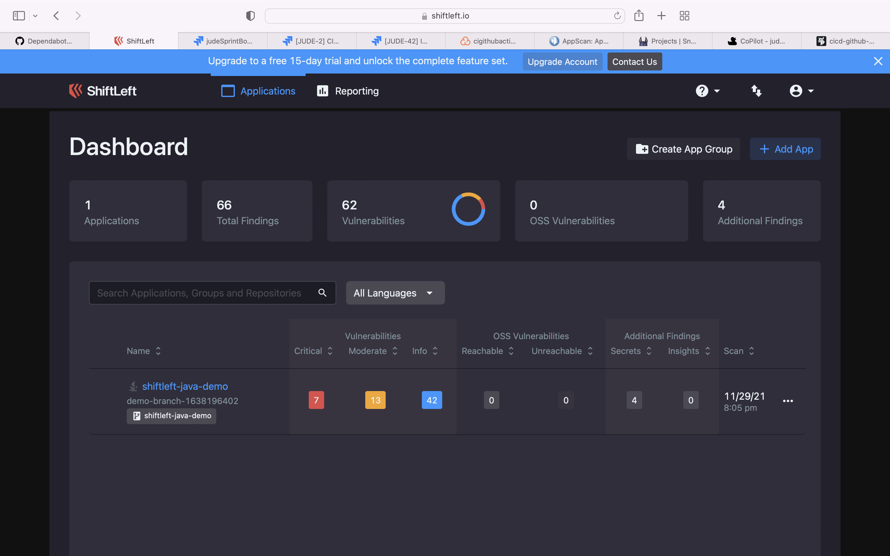

### 12) Snyk - Infrastructure as Code Configs Scan ###
[Snyk](https://snyk.io) (pronounced sneak) is a developer security platform for securing code, dependencies, containers, and infrastructure as code.

Use [Snyk](https://snyk.io) to secure the [Infrastructure as Code Config Files](https://github.com/judebantony/cicd-github-action-example/tree/main/manifests).

```yaml 

  snykIaSScan:
      name: SAST - Scan IaC Configs using Snyk
      runs-on: ubuntu-latest
      needs: [dependabot, snykScan, blackduck, fossaScan]
      
      steps:
        - name: Check out the code
          uses: actions/checkout@v2
          with:
            fetch-depth: 0
        - name: Run Snyk to check configuration files for security issues
          continue-on-error: true
          uses: snyk/actions/iac@master
          env:
            SNYK_TOKEN: ${{ secrets.SNYK_TOKEN }}
          with:
            file: |
              manifests/deployment.yml
              manifests/service.yml
        - name: Upload result to GitHub Code Scanning
          uses: github/codeql-action/upload-sarif@v1
          with:
            sarif_file: snyk.sarif


```


### 13) OPA - Infrastructure as Code Configs Scan ###

The [Open Policy Agent](https://www.openpolicyagent.org/docs/latest/)  (OPA, pronounced “oh-pa”) is an open source, general-purpose policy engine that unifies policy enforcement across the stack. OPA provides a high-level declarative language that lets you specify policy as code and simple APIs to offload policy decision-making from your software. You can use OPA to enforce policies in microservices, Kubernetes, CI/CD pipelines, API gateways, and more.

Use [OPA](https://www.openpolicyagent.org/docs/latest/) to scan the [Infrastructure as Code Config Files](https://github.com/judebantony/cicd-github-action-example/tree/main/manifests) using [OPA Policies](https://github.com/judebantony/cicd-github-action-example/tree/main/opa-policies).

```yaml 

 opa-test:
    name: SAST - Scan IaC Configs Using OPA
    runs-on: ubuntu-latest
    needs: [dependabot, snykScan, blackduck, fossaScan, shitLeftScan]
    
    steps:
        - name: Checkout
          uses: actions/checkout@v2
          with:
            fetch-depth: 0
        - name: OPA-Test manifests standards.
          uses: ameydev/ci-cd-standards-using-opa@master
          env:
            MANIFESTS_PATH_PATTERN: manifests/
            LIBRARY_PATH: opa-policies/
            DATA: data.kubernetes.admission.deny  

```
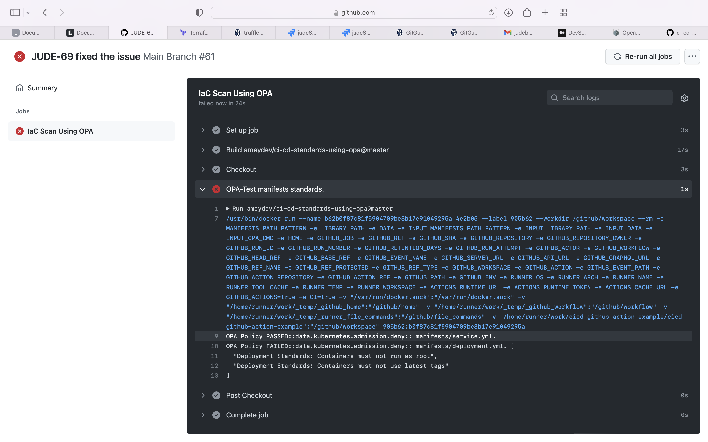


### 14) Trufflehog - Secret Scan ###

[Trufflehog](https://trufflesecurity.com/trufflehog) runs behind the scenes to scan your environment for secrets like private keys and credentials, so you can protect your data before a breach occurs.

Use [Trufflehog](https://trufflesecurity.com/trufflehog) to find any secret present in the source code. 
 
```yaml 

  trufflehogScan:
      name: Secret Scan Using Trufflehog
      runs-on: ubuntu-latest
      needs: [dependabot, snykScan, blackduck, fossaScan]
      
      steps:
        - name: Check out the code
          uses: actions/checkout@v2
          with:
            fetch-depth: 0
        - name: trufflehog-actions-scan
          uses: edplato/trufflehog-actions-scan@master
          with:
            scanArguments: "--regex --entropy=False --max_depth=5" 


```
### 15) GitGuardian - Secret Scan ###
[GitGuardian](https://www.gitguardian.com) is a developers-first solution scanning GitHub activity in real-time for API secret tokens, database credentials, certificates.

Use [GitGuardian](https://www.gitguardian.com) to find any secret present in the source code. [Github integration with GitGuardian](https://docs.gitguardian.com/internal-repositories-monitoring/integrations/ci_cd_integrations/github_actions)
 
```yaml 

 gitguardian:
      name: Secret Scan Using GitGuardian
      runs-on: ubuntu-latest
      needs: [dependabot, snykScan, blackduck, fossaScan, shitLeftScan]
      steps:
        - name: Checkout
          uses: actions/checkout@v2
          with:
            fetch-depth: 0
        - name: GitGuardian scan
          uses: GitGuardian/ggshield-action@master
          with:
            args: -v --all-policies
          env:
            GITHUB_PUSH_BEFORE_SHA: ${{ github.event.before }}
            GITHUB_PUSH_BASE_SHA: ${{ github.event.base }}
            GITHUB_PULL_BASE_SHA: ${{ github.event.pull_request.base.sha }}
            GITHUB_DEFAULT_BRANCH: ${{ github.event.repository.default_branch }}
            GITGUARDIAN_API_KEY: ${{ secrets.GITGUARDIAN_API_KEY }}   


```


### 16) Snyk - Container Image Scan ###
[Snyk](https://snyk.io) (pronounced sneak) is a developer security platform for securing code, dependencies, containers, and infrastructure as code.

Use [Snyk](https://snyk.io) to do container image scan. 

```yaml 

snykImageScan:
      name: Image Scan using Snyk
      runs-on: ubuntu-latest
      needs: [jfrogArtifactPush, gitHubPakageArtifactPush]  
          
      steps:
      - name: Check out the code
        uses: actions/checkout@v1
        with:
          fetch-depth: 0
      - name: Set up JDK 8
        uses: actions/setup-java@v1
        with:
          java-version: 1.8
      - name: Cache Maven packages
        uses: actions/cache@v1
        with:
          path: ~/.m2
          key: ${{ runner.os }}-m2-${{ hashFiles('**/pom.xml') }}
          restore-keys: ${{ runner.os }}-m2
      - name: Package
        run: mvn -B clean package -DskipTests
      - name: Build a Docker image
        run: docker build -t your/image-to-test .
      - name: Run Snyk to check Docker image for vulnerabilities
        continue-on-error: true
        uses: snyk/actions/docker@master
        env:
          SNYK_TOKEN: ${{ secrets.SNYK_TOKEN }}
        with:
          image: your/image-to-test
          args: --sarif-file-output=snyk.sarif --file=Dockerfile
      - name: Upload result to GitHub Code Scanning
        uses: github/codeql-action/upload-sarif@v1
        with:
          sarif_file: snyk.sarif     


```


### 17) Jfrog Artifactory - Publish Artifact(jar) ###

[Jfrog Artifactory](https://jfrog.com/) is the only Universal Repository Manager supporting all major packaging formats, build tools and CI servers.

Upload the Jar to [Jfrog Artifactory](https://jfrog.com/start-free/?utm_source=google&utm_medium=cpc&utm_campaign=14808689020&utm_term=jfrog+artifactory&utm_network=g&cq_plac=&cq_plt=gp&gclid=CjwKCAiAhreNBhAYEiwAFGGKPHkjlShpTBfbPyMgP1l5hGLeiezWo9xCn-3ncNVZCudxMzCdNUhMDhoCIDIQAvD_BwE).

```yaml 

 jfrogArtifactPush:
    name: Publish Artifact to Jfrog Artifactory
    runs-on: ubuntu-latest
    needs: [snykIaSScan, trufflehogScan] 
    
    steps:
      - name: Check out the code
        uses: actions/checkout@v1
        with:
          fetch-depth: 0
      - name: Set up JDK 8
        uses: actions/setup-java@v1
        with:
          java-version: 1.8
      - name: Cache Maven packages
        uses: actions/cache@v1
        with:
          path: ~/.m2
          key: ${{ runner.os }}-m2-${{ hashFiles('**/pom.xml') }}
          restore-keys: ${{ runner.os }}-m2
      - name: Package
        run: mvn -B clean package -DskipTests
      - name: Publish JFrog Artifact
        uses: advancedcsg-open/action-jfrog-cli@master
        with:
          url: 'https://judebantony.jfrog.io/artifactory'
          credentials type: 'username'
          user: ${{ secrets.ARTIFACTORY_USER }}
          password: ${{ secrets.ARTIFACTORY_PASSWORD }}
          args: u "target/*.jar" "/libs-snapshot-repo-libs-release-local" --recursive=true  


```


### 18) GitHub Package - Publish Artifact(jar) ###

[Github Packages](https://docs.github.com/en/packages/learn-github-packages/introduction-to-github-packages) is a software package hosting service that allows you to host your software packages privately or publicly and use packages as dependencies in your projects.

Upload the Jar to [Github Packages](https://docs.github.com/en/packages/learn-github-packages/introduction-to-github-packages).

```yaml 

 gitHubPakageArtifactPush:
    name: Publish Artifact to GitHub Package
    runs-on: ubuntu-latest 
    needs: [snyIaSScan, trufflehogScan] 
    permissions: 
      contents: read
      packages: write 
      
    steps:
      - name: Check out the code
        uses: actions/checkout@v1
        with:
          fetch-depth: 0
      - name: Set up JDK 8
        uses: actions/setup-java@v1
        with:
          java-version: 1.8
      - name: Cache Maven packages
        uses: actions/cache@v1
        with:
          path: ~/.m2
          key: ${{ runner.os }}-m2-${{ hashFiles('**/pom.xml') }}
          restore-keys: ${{ runner.os }}-m2
      - name: Publish package
        run: mvn --batch-mode deploy -DskipTests
        env:
          GITHUB_TOKEN: ${{ secrets.GITHUB_TOKEN }}


```


### 19) JFrog Artifactory - Build Docker Image and Publish ###

[Jfrog Artifactory](https://jfrog.com/) is the only Universal Repository Manager supporting all major packaging formats, build tools and CI servers.

Upload the Container Image to [Jfrog Artifactory](https://jfrog.com/start-free/?utm_source=google&utm_medium=cpc&utm_campaign=14808689020&utm_term=jfrog+artifactory&utm_network=g&cq_plac=&cq_plt=gp&gclid=CjwKCAiAhreNBhAYEiwAFGGKPHkjlShpTBfbPyMgP1l5hGLeiezWo9xCn-3ncNVZCudxMzCdNUhMDhoCIDIQAvD_BwE).

```yaml 

jfrogImageBuild:
    name: Build Docker Image and Publish to JFrog Artifactory
    runs-on: ubuntu-latest
    needs: [snykImageScan, jfrogXrayImageScan]

    steps:
      - name: Check out the code
        uses: actions/checkout@v1
        with:
          fetch-depth: 0
      - name: Set up JDK 8
        uses: actions/setup-java@v1
        with:
          java-version: 1.8
      - name: Cache Maven packages
        uses: actions/cache@v1
        with:
          path: ~/.m2
          key: ${{ runner.os }}-m2-${{ hashFiles('**/pom.xml') }}
          restore-keys: ${{ runner.os }}-m2
      - name: Package
        run: mvn -B clean package -DskipTests
      - name: Set up QEMU️
        uses: docker/setup-qemu-action@v1
      - name: Set up Docker Buildx
        uses: docker/setup-buildx-action@v1
      - name: Login to JFrog  
        uses: docker/login-action@v1
        with:
          registry: 'https://judebantony.jfrog.io'
          username: ${{ secrets.ARTIFACTORY_USER }}
          password: ${{ secrets.ARTIFACTORY_PASSWORD }}        
      - name: Build and Publish Image 
        id: docker_build
        uses: docker/build-push-action@v2
        with:
          context: .
          push: true
          tags: judebantony.jfrog.io/default-docker-local/cigithubaction:latest


```

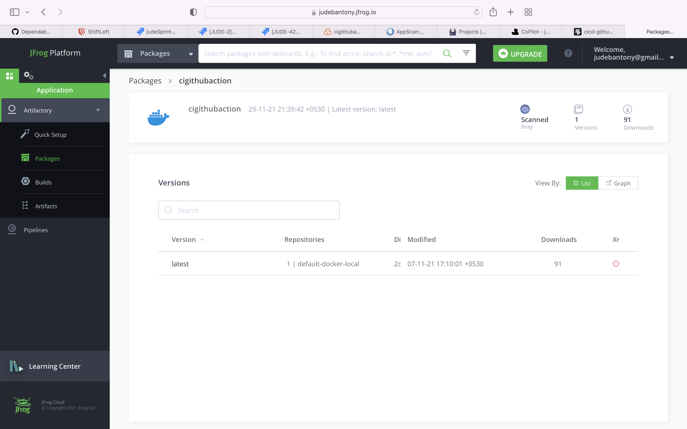

### 20) GitHub Package - Build Docker Image and Publish ###

[Github Packages](https://docs.github.com/en/packages/learn-github-packages/introduction-to-github-packages) is a software package hosting service that allows you to host your software packages privately or publicly and use packages as dependencies in your projects.

Upload the Container Image to [Github Package](https://docs.github.com/en/packages/learn-github-packages/introduction-to-github-packages).

```yaml 

gitHubPakageImageBuild:
    name: Push Docker image to GitHub Package
    runs-on: ubuntu-latest
    needs: [snykImageScan, jfrogXrayImageScan]
    permissions:
      contents: read
      packages: write

    steps:
        - name: Check out the repo
          uses: actions/checkout@v2
          with:
            fetch-depth: 0
        - name: Set up JDK 8
          uses: actions/setup-java@v1
          with:
            java-version: 1.8
        - name: Cache Maven packages
          uses: actions/cache@v1
          with:
            path: ~/.m2
            key: ${{ runner.os }}-m2-${{ hashFiles('**/pom.xml') }}
            restore-keys: ${{ runner.os }}-m2
        - name: Package
          run: mvn -B clean package -DskipTests
        - name: Set up QEMU️
          uses: docker/setup-qemu-action@v1
        - name: Set up Docker Buildx
          uses: docker/setup-buildx-action@v1

        - name: Log in to the Container registry
          uses: docker/login-action@f054a8b539a109f9f41c372932f1ae047eff08c9
          with:
            registry: https://ghcr.io
            username: ${{ github.actor }}
            password: ${{ secrets.GITHUB_TOKEN }}
  
        - name: Extract metadata (tags, labels) for Docker
          id: meta
          uses: docker/metadata-action@98669ae865ea3cffbcbaa878cf57c20bbf1c6c38
          with:
            images: ghcr.io/judebantony/cigithubaction:latest
  
        - name: ghcr.io
          uses: docker/build-push-action@ad44023a93711e3deb337508980b4b5e9bcdc5dc
          with:
            context: .
            push: true
            tags: ghcr.io/judebantony/cigithubaction:latest


```

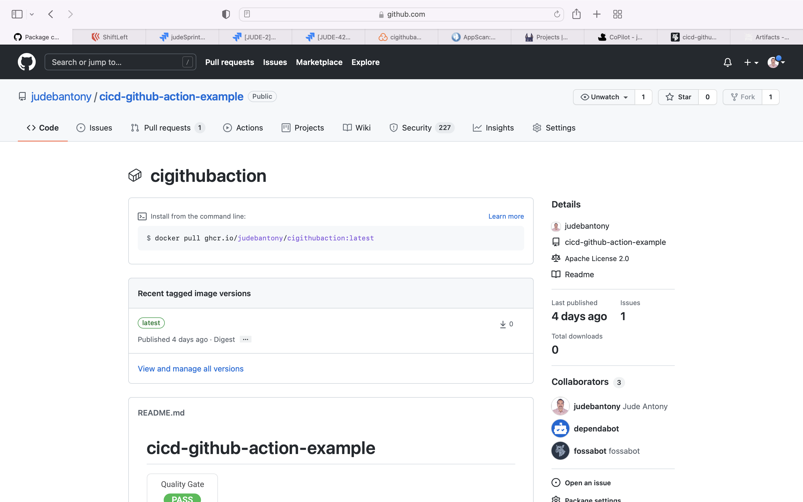

### 21) Docker Hub - Build Docker Image and Publish ###

[Docker hub](https://hub.docker.com) is the world's easiest way to create, manage, and deliver your teams' container applications.

Upload the Container Image to [Docker hub](https://hub.docker.com).

```yaml 

 dockerHubImageBuild:
      name: Push Docker image to Docker Hub
      runs-on: ubuntu-latest
      needs: [snykImageScan, jfrogXrayImageScan]
      
      steps:
        - name: Check out the repo
          uses: actions/checkout@v2
          with:
            fetch-depth: 0
        - name: Set up JDK 8
          uses: actions/setup-java@v1
          with:
            java-version: 1.8
        - name: Cache Maven packages
          uses: actions/cache@v1
          with:
            path: ~/.m2
            key: ${{ runner.os }}-m2-${{ hashFiles('**/pom.xml') }}
            restore-keys: ${{ runner.os }}-m2
        - name: Package
          run: mvn -B clean package -DskipTests
        - name: Log in to Docker Hub
          uses: docker/login-action@f054a8b539a109f9f41c372932f1ae047eff08c9
          with:
            username: ${{ secrets.DOCKER_USERNAME }}
            password: ${{ secrets.DOCKER_PASSWORD }}
        
        - name: Extract metadata (tags, labels) for Docker
          id: meta
          uses: docker/metadata-action@98669ae865ea3cffbcbaa878cf57c20bbf1c6c38
          with:
            images: docker.io/judebantony/cigithubaction
        
        - name: Build and push Docker image
          uses: docker/build-push-action@ad44023a93711e3deb337508980b4b5e9bcdc5dc
          with:
            context: .
            push: true
            tags: ${{ steps.meta.outputs.tags }}
            labels: ${{ steps.meta.outputs.labels }}


```

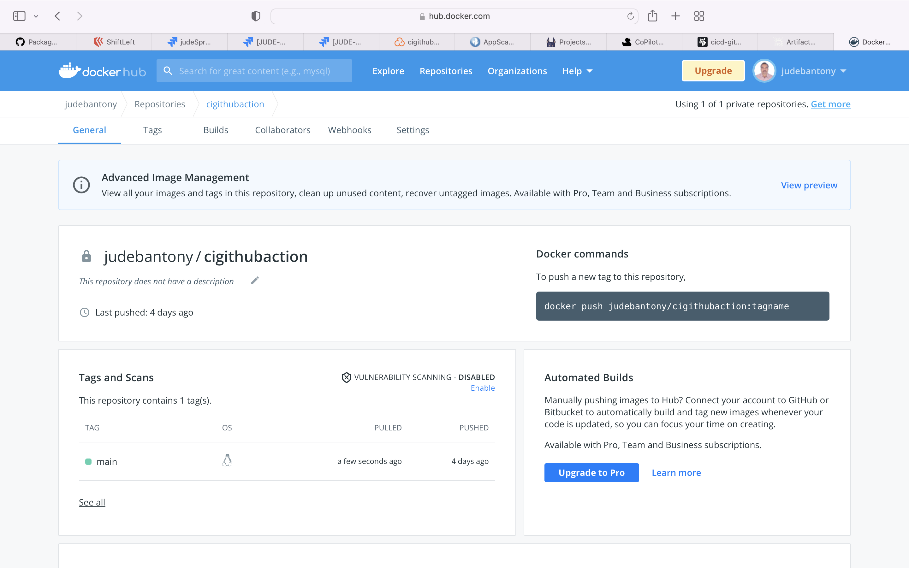

### 22) CD - Deploy to Azure AKS ###

AKS allows you to quickly deploy a production ready Kubernetes cluster in Azure.

Deploy the Container image to [Azure AKS](https://azure.microsoft.com/en-in/services/kubernetes-service/), [kubernetes](https://kubernetes.io) manifest files are available  [here](https://github.com/judebantony/cicd-github-action-example/tree/main/manifests).

```yaml 

  qadeploy:
    name: QA Deployment to AKS 
    runs-on: ubuntu-latest
    needs: [jfrogImageBuild, dockerHubImageBuild, gitHubPakageImageBuild]

    steps:
      - name: Check out the code
        uses: actions/checkout@v1
        with:
          fetch-depth: 0
      - name: Login to JFrog  
        uses: docker/login-action@v1
        with:
          registry: 'https://judebantony.jfrog.io'
          username: ${{ secrets.ARTIFACTORY_USER }}
          password: ${{ secrets.ARTIFACTORY_PASSWORD }}        
      - name: Setting AKS Context 
        uses: azure/aks-set-context@v1
        with:
          creds: ${{ secrets.AZURE_CREDENTIALS }}
          cluster-name: 'JudeAKSCluster'
          resource-group: 'DefaultResourceGroup-EUS'
      - name: Create AKS Namespace     
        run: |
            kubectl create namespace cigithubactionqa --dry-run -o json | kubectl apply -f -
      - name: Create Secret     
        uses: azure/k8s-create-secret@v1
        with:
          container-registry-url: 'https://judebantony.jfrog.io'
          container-registry-username: ${{ secrets.ARTIFACTORY_USER }}
          container-registry-password: ${{ secrets.ARTIFACTORY_PASSWORD }}
          namespace: 'cigithubactionqa'
          secret-name: 'cigithubactionqa-crd'
      - name: Deploy app to AKS 
        uses: azure/k8s-deploy@v1
        with:
          manifests: |
            manifests/deployment.yml
            manifests/service.yml
          images: |
             judebantony.jfrog.io/default-docker-local/cigithubaction:latest
          imagepullsecrets: |
            cigithubactionqa-crd   
          namespace: 'cigithubactionqa'         


```


### 23) Functional Test - Using Cucumber. ###

[Cucumber](https://cucumber.io) Open is the world's leading tool for BDD.

Run the [Cucumber](https://cucumber.io) Test Cases and upload the result to Cucumber.io and github action. The feature files are present [here](https://github.com/judebantony/cicd-github-action-example/tree/main/src/test/resources/com/jba/ci/bdd/).
 
```yaml 

  qatest:
    name: QA Validation and Report
    runs-on: ubuntu-latest
    needs: [qadeploy]
    
    steps:
      - name: Check out the code
        uses: actions/checkout@v1
        with:
          fetch-depth: 0
      - name: Set up JDK
        uses: actions/setup-java@v1
        with:
          java-version: 1.8
      - name: Cache Maven packages
        uses: actions/cache@v1
        with:
          path: ~/.m2
          key: ${{ runner.os }}-m2-${{ hashFiles('**/pom.xml') }}
          restore-keys: ${{ runner.os }}-m2     
      - name: Run Test Automation
        run: mvn -B verify -DexcludedGroups="Staging | LamdaTest | BrowserStack" -Dgroups="Smoke"
        env: 
          CUCUMBER_PUBLISH_TOKEN: ${{secrets.CUCUMBER_PUBLISH_TOKEN}}
      - name: Upload Test Automation Report
        uses: deblockt/cucumber-report-annotations-action@v1.7
        with:
          access-token: ${{ secrets.GITHUB_TOKEN }}
          path: "target/cucumber-reports/cucumber.json"
          check-status-on-error: 'neutral'
          annotation-status-on-error: 'warning'    
      - name: Upload Cucumber report
        uses: actions/upload-artifact@v2
        with:
          name: cucumber-report
          path: target/cucumber-reports/cucumber.html

```

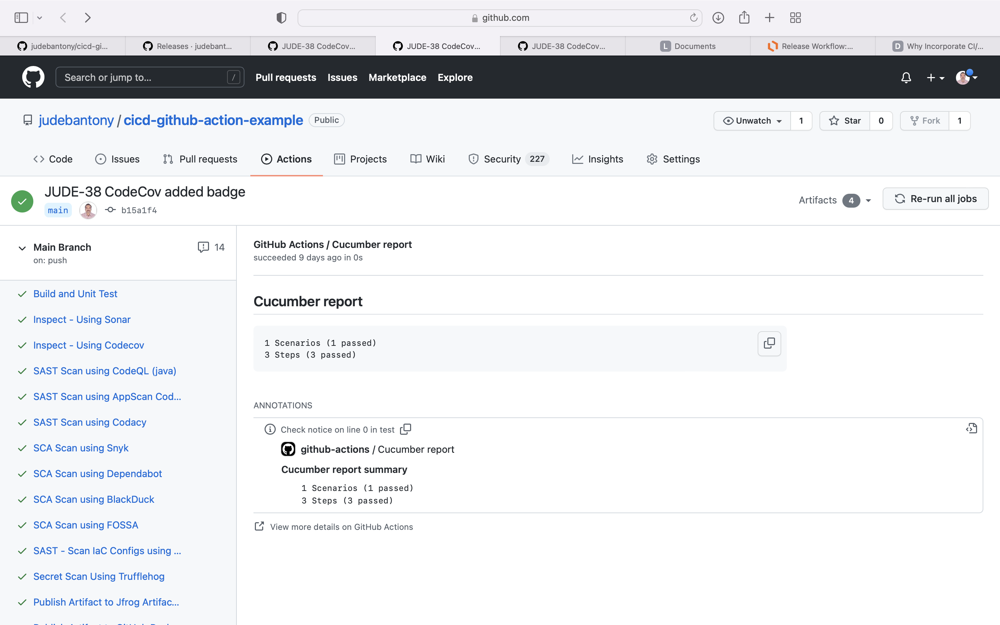

Upload the result to Cucumber.io Report

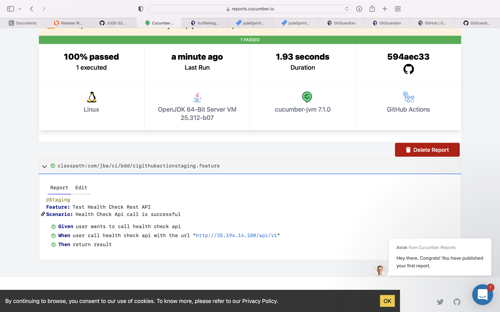

### 24) Functional UI Test - Using BrowserStack. ###
[BrowserStack](https://www.browserstack.com) is an Indian cloud web and mobile testing platform that provides developers with the ability to test their websites and mobile applications across on-demand browsers, operating systems and real mobile devices.

[Selenium](https://www.selenium.dev) is an open-source umbrella project for a range of tools and libraries aimed at supporting web browser automation. Selenium provides a playback tool for authoring functional tests without the need to learn a test scripting language.

Run the [Selenium](https://www.selenium.dev) UI [Cucumber](https://cucumber.io) Test Cases using [BrowserStack](https://www.browserstack.com) and capture the result. The feature files are present [here](https://github.com/judebantony/cicd-github-action-example/tree/main/src/test/resources/com/jba/ci/bdd/).

```yaml 

  browserStackTest:
    name: 'BrowserStack QA Test Validation'
    runs-on: ubuntu-latest 
    needs: [qadeploy]
    
    steps:

      - name: 'BrowserStack Env Setup'  
        uses: browserstack/github-actions/setup-env@master
        with:
          username:  ${{ secrets.BROWSERSTACK_USERNAME }}
          access-key: ${{ secrets.BROWSERSTACK_ACCESS_KEY }}

      - name: 'BrowserStack Local Tunnel Setup' 
        uses: browserstack/github-actions/setup-local@master
        with:
          local-testing: start
          local-identifier: random

      - name: Check out the code
        uses: actions/checkout@v1
        with:
          fetch-depth: 0
      - name: Set up JDK
        uses: actions/setup-java@v1
        with:
          java-version: 1.8
      - name: Cache Maven packages
        uses: actions/cache@v1
        with:
          path: ~/.m2
          key: ${{ runner.os }}-m2-${{ hashFiles('**/pom.xml') }}
          restore-keys: ${{ runner.os }}-m2     
      - name: Run BrowserStack Test Automation
        run: mvn -B verify -DexcludedGroups="Staging | Smoke | LamdaTest" -Dgroups="BrowserStack"
        env: 
          CUCUMBER_PUBLISH_TOKEN: ${{secrets.CUCUMBER_PUBLISH_TOKEN}}

      - name: 'BrowserStackLocal Stop'  
        uses: browserstack/github-actions/setup-local@master
        with:
          local-testing: stop

```

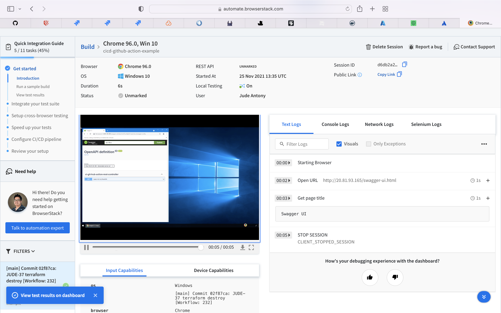

### 25) Functional UI Test - Using LamdaTest. ###

Run your [Selenium](https://www.selenium.dev) test automation scripts across online selenium grid of desktop, Android and iOS mobile browsers. Develop, test, and deliver faster every time with automated cross browser testing using LambdaTest online Automation Browser Testing Grid.

Run the [Selenium](https://www.selenium.dev) UI [Cucumber](https://cucumber.io) Test Cases using [LamdaTest](https://www.lambdatest.com/?fp_ref=aliakbar42) and capture the result. The feature files are present [here](https://github.com/judebantony/cicd-github-action-example/tree/main/src/test/resources/com/jba/ci/bdd/).

```yaml 

  lamdaTest:
    name: 'LamdaTest QA Test Validation'
    runs-on: ubuntu-latest 
    needs: [qadeploy]
    
    steps:
      - name: Start Tunnel
        id: tunnel
        uses: LambdaTest/LambdaTest-tunnel-action@v1
        with:
          user: ${{ secrets.LT_EMAIL }}
          accessKey: ${{ secrets.LT_ACCESS_KEY }}
          tunnelName: "testTunnel"
      - name: Check out the code
        uses: actions/checkout@v1
        with:
          fetch-depth: 0
      - name: Set up JDK
        uses: actions/setup-java@v1
        with:
          java-version: 1.8
      - name: Cache Maven packages
        uses: actions/cache@v1
        with:
          path: ~/.m2
          key: ${{ runner.os }}-m2-${{ hashFiles('**/pom.xml') }}
          restore-keys: ${{ runner.os }}-m2     
      - name: Run LamdaTest Automation
        run: mvn -B verify -DexcludedGroups="Staging | Smoke | BrowserStack" -Dgroups="LamdaTest"
        env: 
          CUCUMBER_PUBLISH_TOKEN: ${{secrets.CUCUMBER_PUBLISH_TOKEN}}
          LT_EMAIL: ${{ secrets.LT_EMAIL }}
          LT_ACCESS_KEY: ${{ secrets.LT_ACCESS_KEY }}
      - name: Export Tunnel Logs for debugging
        uses: actions/upload-artifact@v2
        with:
           name: tunnel_logs
           path: ${{ steps.tunnel.outputs.logFileName }}          

```

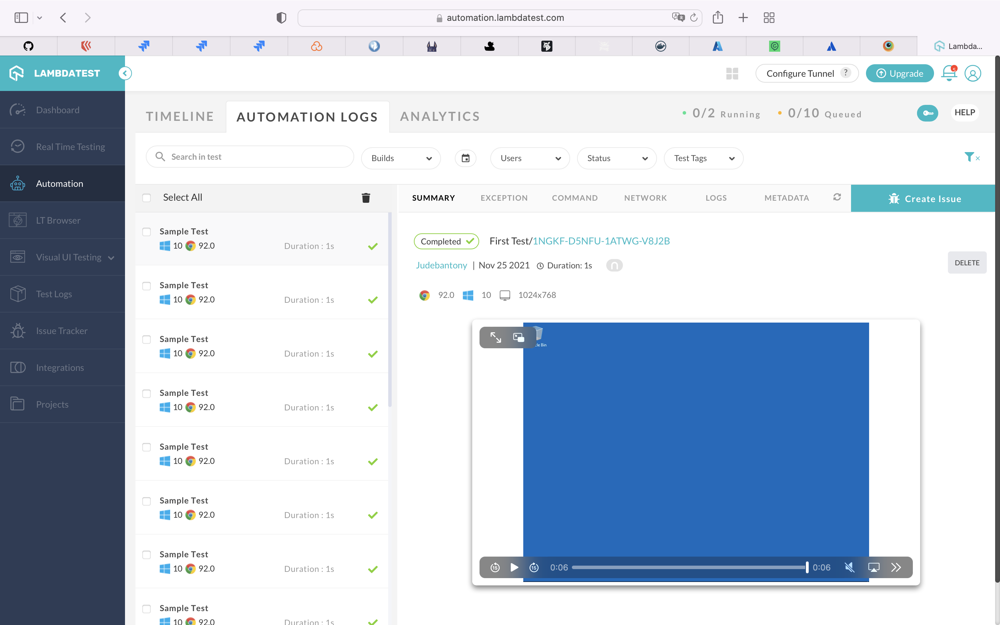

### 26) DAST Scan - Using StackHawk. ###
[StackHawk](https://www.stackhawk.com) makes it simple for developers to find, triage, and fix application security bugs. Scan your application for AppSec bugs in the code your team wrote, triage and fix with provided documentation, and automate in your pipeline to prevent future bugs from hitting prod.

Use [StackHawk](https://www.stackhawk.com) for DAST scan for all the [OpenAPI](https://swagger.io/specification/) compliant REST APIs. StackHawk config file is present [here](https://github.com/judebantony/cicd-github-action-example/tree/main/stackhawl.yml).

```yaml 

  stackhawkScan:
    name: DAST Scan using StackHawk
    runs-on: ubuntu-20.04
    needs: [qatest, browserStackTest, lamdaTest]

    steps:
      - name: Checkout code
        uses: actions/checkout@v2
        with:
          fetch-depth: 0
      - name: Download OpenAPI Spec
        run: |
          curl http://20.81.93.165/api-docs > openapi.json
      - name: Run HawkScan
        uses: stackhawk/hawkscan-action@v1.3.2
        continue-on-error: true
        with:
          apiKey: ${{ secrets.HAWK_API_KEY }}
          configurationFiles: stackhawk.yml
          codeScanningAlerts: true
          githubToken: ${{ secrets.GITHUB_TOKEN }}   
          environmentVariables: |
            APP_HOST
            APP_ENV
            APP_ID
        env:
          APP_HOST: http://20.81.93.165
          APP_ENV: Development
          APP_ID: ea0079f1-648e-4bdb-aa2d-233696082b4e

```

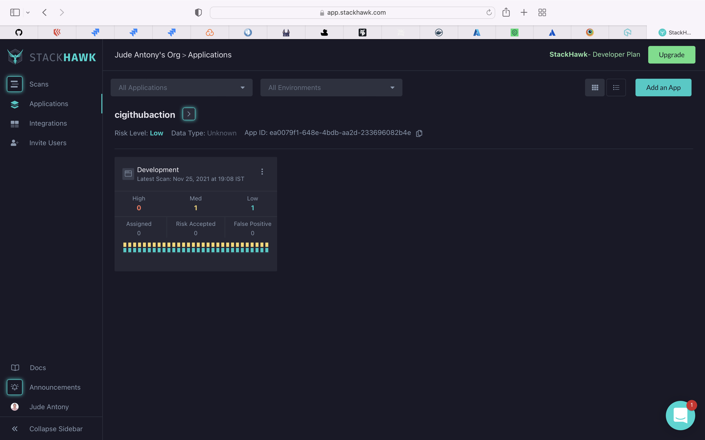

### 27) DAST Scan - Using OWASP ZAP. ###

[OWASP ZAP](https://github.com/marketplace/actions/owasp-zap-api-scan) is an open-source web application security scanner. It is intended to be used by both those new to application security as well as professional penetration testers. It is one of the most active Open Web Application Security Project projects and has been given Flagship status.

Use [OWASP ZAP](https://github.com/marketplace/actions/owasp-zap-api-scan) for DAST scan for all the [OpenAPI](https://swagger.io/specification/) compliant REST APIs. OWASP ZAP rule file is present [here](https://github.com/judebantony/cicd-github-action-example/tree/main/zap/).

```yaml 

  zap_scan:
      runs-on: ubuntu-latest
      name: DAST Scan using OWASP ZAP
      needs: [qatest, browserStackTest, lamdaTest]
       
      steps:
        - name: Checkout
          uses: actions/checkout@v2
          with:
            fetch-depth: 0
        - name: ZAP Scan
          uses: zaproxy/action-api-scan@v0.1.0
          with:
            token: ${{ secrets.GITHUB_TOKEN }}
            docker_name: 'owasp/zap2docker-stable'
            format: openapi
            target: 'http://35.194.14.180/api-docs'
            rules_file_name: 'zap/rules.tsv'
            cmd_options: '-a'

```

Scan result is uploaded in Github Action.
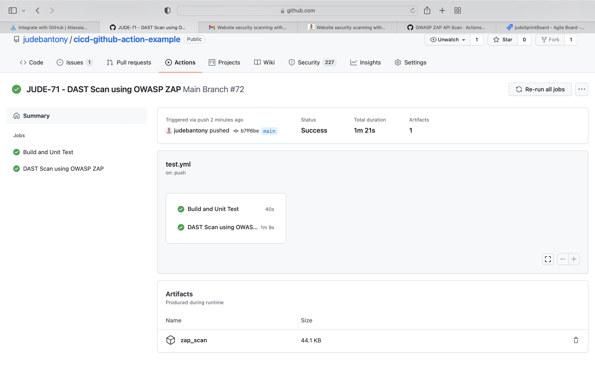
Issue created on GitHub
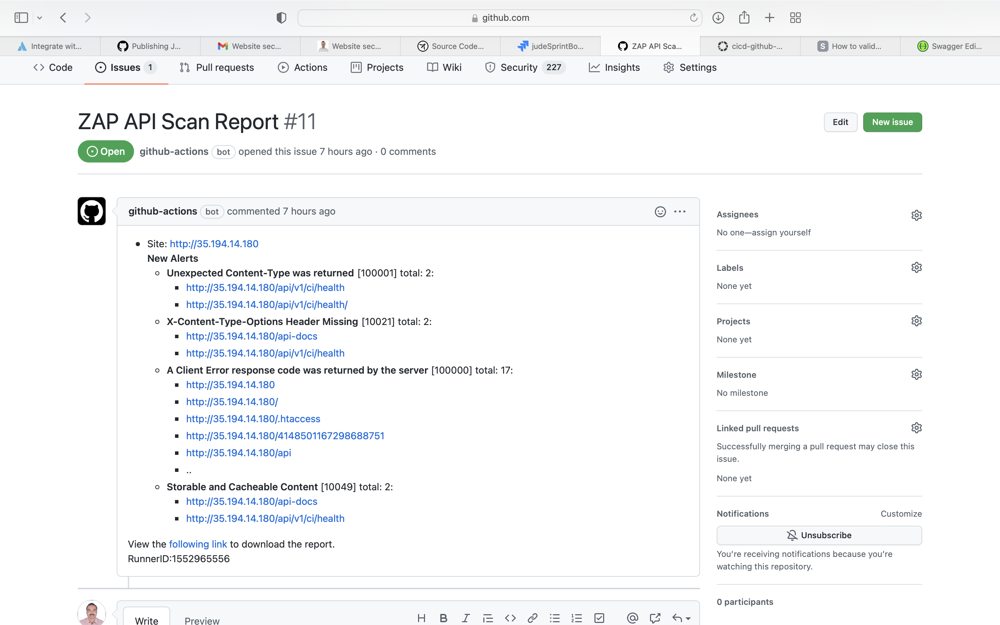

### 28) API Validator - Using Swagger Editor Validator. ###
[Swagger Editor](https://swagger.io/blog/api-design/validate-openapi-definitions-swagger-editor/) lets you edit Swagger API specifications in YAML inside your browser and to preview documentations in real time. Valid Swagger JSON descriptions can then be generated and used with the full Swagger tooling (code generation, documentation, etc).


Use [Swagger Editor Validator](https://swagger.io/blog/api-design/validate-openapi-definitions-swagger-editor/) for validating the [OpenAPI Specification](https://swagger.io/specification/) of REST APIs .

```yaml 

 test_swagger_editor_validator:
    runs-on: ubuntu-latest
    name: Swagger Editor Validator Remote
    needs: [stackhawkScan, zap_scan]
    steps:
      - name: Checkout
        uses: actions/checkout@v2
        with:
          fetch-depth: 0
      - name: Download OpenAPI Spec
        run: |
          curl http://35.194.14.180/api-docs > openapi.json
      - name: Validate OpenAPI definition
        uses: char0n/swagger-editor-validate@v1.2.1
        with:
          definition-file: openapi.json   

```
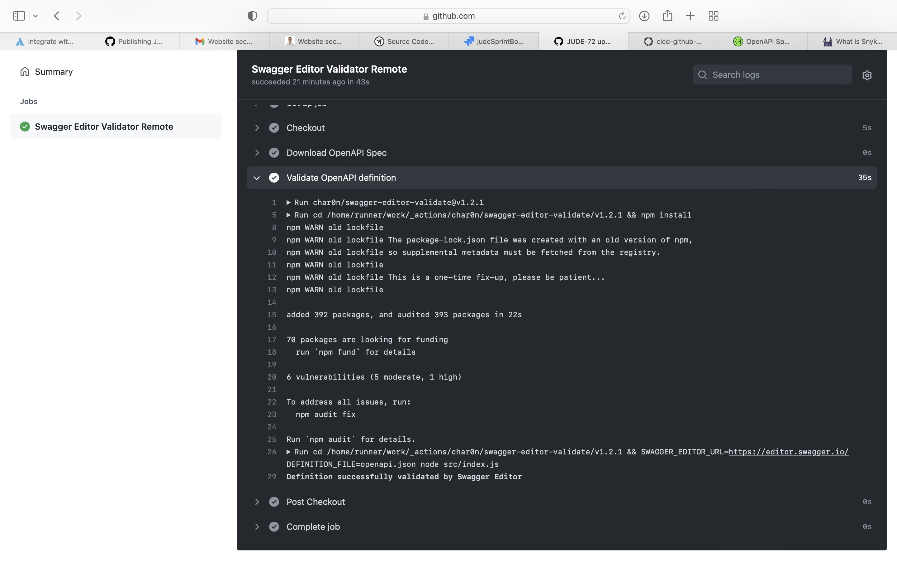


### 29) Setting up Approval Gates and Email. ###

Set up approval gates for deployment using [Github Environment](https://docs.github.com/en/actions/deployment/targeting-different-environments/using-environments-for-deployment).

```yaml 

 stagingdeployapproval:
    name: Waiting for Staging Deployment Approval
    runs-on: ubuntu-latest
    needs: [stackhawkScan]
    environment: staging
    
    steps:
      - name: Email Status
        uses: dawidd6/action-send-mail@v3
        with:
          server_address: smtp.gmail.com
          server_port: 465
          username: ${{secrets.MAIL_USERNAME}}
          password: ${{secrets.MAIL_PASSWORD}}
          subject: Stage Deployment ${{github.repository}} waiting for your approval.
          to: judebantony@gmail.com
          from: judebantonyofficial@gmail.com
          body: Please review the test result and approve it.
          reply_to: judebantonyofficial@gmail.com
          in_reply_to: judebantonyofficial@gmail.com
          ignore_cert: true
          convert_markdown: true
          priority: low

```

### 30) CD - Deploy to Azure AKS using Helm. ###
[Helm](https://helm.sh) helps you manage Kubernetes applications — Helm Charts help you define, install, and upgrade even the most complex Kubernetes application.

Deploy the Container image to [Azure AKS](https://azure.microsoft.com/en-in/services/kubernetes-service/) using [Helm](https://helm.sh), manifest files are available  [here](https://github.com/judebantony/cicd-github-action-example/tree/main/helm).

```yaml 

 stagingdeploy:         
    name: Staging Deployment Using Helm To AKS
    runs-on: ubuntu-latest
    needs: [stagingdeployapproval]

    steps:
      - name: Check out the code
        uses: actions/checkout@v1
        with:
          fetch-depth: 0
      - name: Install Helm
        uses: Azure/setup-helm@v1
        with:
          version: v3.7.1    
      - name: Login to JFrog  
        uses: docker/login-action@v1
        with:
          registry: 'https://judebantony.jfrog.io'
          username: ${{ secrets.ARTIFACTORY_USER }}
          password: ${{ secrets.ARTIFACTORY_PASSWORD }}        
      - name: Setting AKS Context 
        uses: azure/aks-set-context@v1
        with:
          creds: ${{ secrets.AZURE_CREDENTIALS }}
          cluster-name: 'JudeAKSCluster'
          resource-group: 'DefaultResourceGroup-EUS'
      - name: Create AKS Namespace     
        run: |
            kubectl create namespace cigithubactionstaging --dry-run -o json | kubectl apply -f -
      - name: Create Secret     
        uses: azure/k8s-create-secret@v1
        with:
          container-registry-url: 'https://judebantony.jfrog.io'
          container-registry-username: ${{ secrets.ARTIFACTORY_USER }}
          container-registry-password: ${{ secrets.ARTIFACTORY_PASSWORD }}
          namespace: 'cigithubactionstaging'
          secret-name: 'cigithubactionstaging-crd'
      - name: Run Helm Deploy
        run: |
         helm upgrade \
              --install \
              --create-namespace \
              --atomic \
              --wait \
              --namespace cigithubactionstaging \
              cigithubaction \
              ./helm/aks \

```

### 31) CD - Deploy to Google GKE using Harness. ###

The [Harness](https://harness.io) Software Delivery Platform includes Continuous Integration, Continuous Delivery, Continuous Efficiency, Continuous Verification, and Continuous Features. The platform is designed to help companies accelerate their cloud initiatives as well as their adoption of containers and orchestration tools like Kubernetes and Amazon ECS.

Deploy the Container image to [Google GKE](https://cloud.google.com/kubernetes-engine/?utm_source=google&utm_medium=cpc&utm_campaign=japac-IN-all-en-dr-bkws-all-all-trial-e-dr-1009882&utm_content=text-ad-none-none-DEV_c-CRE_468709677813-ADGP_Hybrid%20%7C%20BKWS%20-%20EXA%20%7C%20Txt%20~%20Containers%20~%20Kubernetes%20Engine_Kubernetes-gke-KWID_43700033867246010-aud-970366092687%3Akwd-372556496315&userloc_9299054-network_g&utm_term=KW_google%20gke&ds_rl=1264446&gclid=CjwKCAiAhreNBhAYEiwAFGGKPBhVfsfPwkEB1Yzehiow3pcsq-P9Pv78G4P28anuVF9HtSPtoNZCFxoCqr0QAvD_BwE&gclsrc=aw.ds) using [Harness](https://harness.io).

```yaml 

  uatdeploy:
    name: UAT Deployment using Harness
    runs-on: ubuntu-latest
    needs: [uateployapproval]

    steps:
      - name: Run Harness UAT Deployment
        run: |
          curl -X POST -H 'content-type: application/json' --url https://app.harness.io/gateway/api/webhooks/Tlugr1ZdISx44rvm4flAiXHMb3uKG3ikyiHSbOks?accountId=aGS5Pi_WSPa9IsdlTlJc7g -d '{"application":"1FYrnQdZROqjpAQdCBIMbw"}'
```


Harness
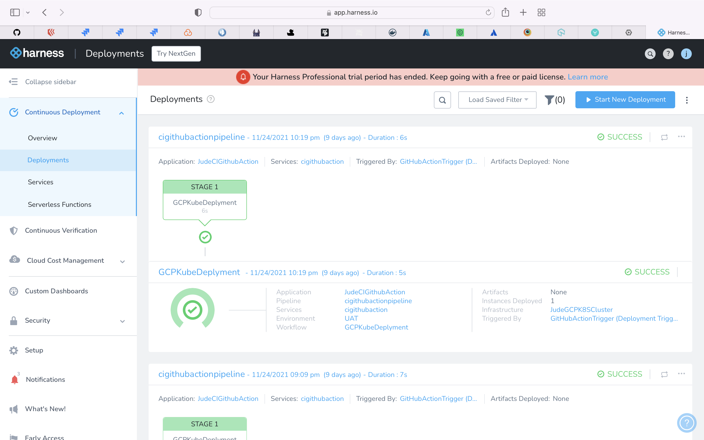 

### 32) Load/Performance Testing - K6. ###
[K6](https://k6.io) is an open-source load testing tool and cloud service providing the best developer experience for API performance testing.

Performance Test using [K6](https://k6.io). Load Test file is present here [here](https://github.com/judebantony/cicd-github-action-example/tree/main/k6-test.js).

```yaml 

  k6_cloud_test:
    name: Perf Testing - k6 cloud test run
    runs-on: ubuntu-latest
    needs: [terraform]
    steps:
      - name: Checkout
        uses: actions/checkout@v1
        with:
          fetch-depth: 0
      - name: Run k6 cloud test
        uses: k6io/action@v0.1
        with:
          filename: k6-test.ts
          cloud: true
          token: ${{ secrets.K6_CLOUD_API_TOKEN }}

```


### 33) Functional Test using Xray and Jira. ###
[XRay](https://www.getxray.app) is a Test Management tool. Built for every member of your team to plan, test, track and release great software · Manage all your Tests as Jira issues.

Create the test case using [Gherkin](https://cucumber.io/docs/gherkin/) and [Cucumber](https://cucumber.io) in Jira for each story and execute as part of CI/CD. Upload the result back to Jira. XRay Test Execution config file is present [here](https://github.com/judebantony/cicd-github-action-example/tree/main/testexec_cloud_template.json).

```yaml 

  jiraXrayTest:
    name: Functional Test using Xray and Jira 
    runs-on: ubuntu-latest
    needs: [uatdeploy]
        
    steps:
      - name: Check out the code
        uses: actions/checkout@v1
        with:
          fetch-depth: 0
      - name: Set up JDK
        uses: actions/setup-java@v1
        with:
          java-version: 1.8
      - name: Cache Maven packages
        uses: actions/cache@v1
        with:
          path: ~/.m2
          key: ${{ runner.os }}-m2-${{ hashFiles('**/pom.xml') }}
          restore-keys: ${{ runner.os }}-m2    
      - name: Get Xray Cloud API token
        env:
          CLIENT_ID: ${{ secrets.XRAY_CLIENT_ID }}  
          CLIENT_SECRET: ${{ secrets.XRAY_CLIENT_SECRET }}
        id: xray-token
        run: |
          echo ::set-output name=XRAY_TOKEN::$(curl -H "Content-Type: application/json" -X POST --data "{ \"client_id\": \"$CLIENT_ID\",\"client_secret\": \"$CLIENT_SECRET\" }" https://xray.cloud.xpand-it.com/api/v1/authenticate| tr -d '"')
      - name: Get Features from XRAY 
        shell: bash
        run: |
           curl -H "Content-Type: application/json" --output ./features.zip -X GET -H "Authorization: Bearer ${{ steps.xray-token.outputs.XRAY_TOKEN }}"  "https://xray.cloud.xpand-it.com/api/v1/export/cucumber?keys=JUDE-43"
           unzip -o features.zip -d ./src/test/resources/com/jba/ci/bdd/   
      - name: Build
        run: mvn -B clean package -DskipTests
      - name: Run UnitTest and Verify 
        run: mvn -B verify -DexcludedGroups="Smoke | Staging | BrowserStack | LamdaTest"
      - name: Generate JaCoCo Badge
        id: jacoco
        uses: cicirello/jacoco-badge-generator@v2
      - name: Log code coverage percentage
        run: |
          echo "coverage = ${{ steps.jacoco.outputs.coverage }}"
          echo "branch coverage = ${{ steps.jacoco.outputs.branches }}"
      - name: Upload to XRAY 
        shell: bash
        run: |
           curl  -X POST -H "Authorization: Bearer ${{ steps.xray-token.outputs.XRAY_TOKEN }}" -F info=@testexec_cloud_template.json -F results=@"target/cucumber-reports/cucumber.json" "https://xray.cloud.xpand-it.com/api/v1/import/execution/cucumber/multipart"          

```


### 34) Release Tag Creation. ###
Create a release tag for the branch. 

```yaml 

  releaseTag:
      name: Release Tag Creation 
      runs-on: ubuntu-latest
      needs: [k6_cloud_test]
      steps:
        - name: Checkout
          uses: actions/checkout@v2
          with:
            fetch-depth: 0
        - name: Bump version and push tag
          id: tag_version
          uses: anothrNick/github-tag-action@1.26.0
          env:
            GITHUB_TOKEN: ${{ secrets.GITHUB_TOKEN }}
            WITH_V: true
        - name: Create a GitHub release
          uses: ncipollo/release-action@v1
          with:
            tag: ${{ steps.tag_version.outputs.new_tag }}
            name: Release ${{ steps.tag_version.outputs.new_tag }}
            body: ${{ steps.tag_version.outputs.changelog }}  

```


### 35) IaC - using Terraform - Create AWS EC2. ###
[Terraform](https://www.terraform.io) is an open-source infrastructure as code software tool created by HashiCorp. Users define and provide data center infrastructure using a declarative configuration language known as HashiCorp Configuration Language, or optionally JSON.

Set up the AWS EC2 instances using [Terraform](https://www.terraform.io) , terraform manifest file is available [here](https://github.com/judebantony/cicd-github-action-example/tree/main/terraform).

```yaml 

  terraform:
    name: "Terraform - Create AWS EC2"
    runs-on: ubuntu-latest
    needs: [uatdeploy]
    steps:
      - name: Checkout
        uses: actions/checkout@v2
        with:
          fetch-depth: 0
      - name: Setup Terraform
        uses: hashicorp/setup-terraform@v1
        with:
          cli_config_credentials_token: ${{ secrets.TF_API_TOKEN }}
      - name: Terraform Format
        id: fmt
        run: |
            cd terraform/
            terraform fmt -check
      - name: Terraform Init
        id: init
        run: |
            cd terraform/
            terraform init
      - name: Terraform Validate
        id: validate
        run: |
            cd terraform/
            terraform validate -no-color
      - name: Terraform Plan
        id: plan
        run: |
            cd terraform/
            terraform plan -no-color
        continue-on-error: true
      - uses: actions/github-script@0.9.0
        id: return_plan_outpot
        env:
          PLAN: "terraform\n${{ steps.plan.outputs.stdout }}"
        with:
          github-token: ${{ secrets.GITHUB_TOKEN }}
          script: |
            const output = `#### Terraform Format and Style \`${{ steps.fmt.outcome }}\`
            #### Terraform Initialization ️\`${{ steps.init.outcome }}\`
            #### Terraform Validation \`${{ steps.validate.outcome }}\`
            #### Terraform Plan \`${{ steps.plan.outcome }}\`
            <details><summary>Show Plan</summary>
            \`\`\`\n
            ${process.env.PLAN}
            \`\`\`
            </details>
            *Pusher: @${{ github.actor }}, Action: \`${{ github.event_name }}\`*`;
            return output;
      - name: Create plan result
        uses: "finnp/create-file-action@master"
        env:
          FILE_NAME: "plan.html" 
          FILE_DATA: "${{steps.return_plan_outpot.outputs.result}}"     
        
      - name: Upload Terraform Plan result
        uses: actions/upload-artifact@v2
        with:
          name: terrform-plan-result
          path: plan.html
             
      - name: Terraform Plan Status
        if: steps.plan.outcome == 'failure'
        run: exit 1
        
      - name: Terraform Apply
        run: |
            cd terraform/
            terraform apply -auto-approve  

```


## Author

* **Jude Antony** ([LinkedIn](https://www.linkedin.com/in/jude-antony-2b208219/)) - ([GitHub](https://github.com/judebantony))

## License

This project is licensed under the Apache License - see the [LICENSE](LICENSE) file for details
